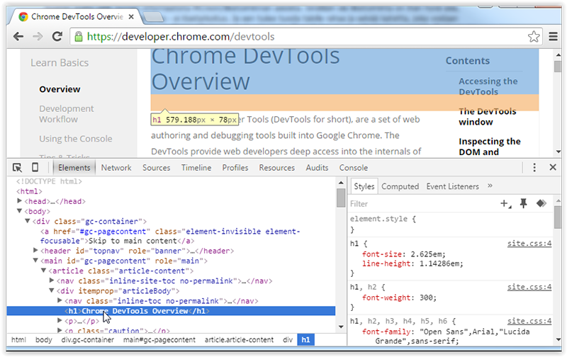

class: center, middle

# Mobile Web Development Toolchain


## 1/2017

---

# Contents

- Editor/IDE: Visual Studio Code, vscode (or any)
- Language: TypeScript
- Run, test & debug: Chrome browser      
- Version Control System: Git
- Package managers: NPM
- Building & automating tasks: Angular CLI (webpack)
- Development frameworks: Angular2, Ionic2
- Creating a native (hybrid) app: Ionic (Cordova)

---

# Code editor or IDE

Ultimately, it's your choice. VSCode is recommended.

#### Visual Studio Code

- free & open source code editor by Microsoft (**!=** Visual Studio IDE)
- wide extension support
- lightweight, multiplatform support
- good [docs & instructions](https://code.visualstudio.com/docs/editor/codebasics)
- choice of many Angular2 developers

#### Other picks

- [Atom](https://atom.io/)
- [Brackets](http://brackets.io/)
- [WebStorm](https://www.jetbrains.com/webstorm/)
  - free student license (only @metropolia.fi email address needed)
  - full featured IDE
  - based on IntelliJ IDEA, just like Android Studio
- Other IDEs like: IntelliJ Ultimate IDEA, Eclipse, NetBeans... 

---

# Browser

- Chrome & [Chrome DevTools](https://developers.google.com/web/tools/chrome-devtools/) 
      


---

# Package Management

## [NPM](https://www.npmjs.com/) - node.js package manager

- Install [node.js](https://nodejs.org/en/) to get the package manager **npm**
- npm packages needed in a project (dependencies) are listed in the `package.json` file and can be install with `npm install` command
- locally installed (=project specific) packages are downloaded to `node_modules/` folder

???
      
package installation folders should be excluded from version control

---

# Example package.json

```js
{
  "name": "example-app",
  "version": "0.0.1",
  "author": "Example Coder <ecoder@example.com>",
  "description": "An example app doing something",
  "license": "MIT",
  "scripts": {
    "start": "node ./app.js"
  },
  "dependencies": {
    "@angular/common": "~2.1.0",
    "@angular/core": "~2.1.0"
  }        }
}

```

---

# Automating Development Tasks

**angular-cli (ng-cli)** tool - `ng` command.

- Run frequent routine tasks in development workflow easily
- Create app skeleton
- Gemerate app components 
- Run tests
- Validate code
- Build/Deploy application
  - Minify & combine source files
  - Remove comments & other extra stuff not needed in production version

#### Other generic JS task runners

- [Grunt](http://gruntjs.com/) & Gruntfile.js (like make & makefile in C)
- [Gulp](http://gulpjs.com/) & Gulpfile.js 

---

# Frameworks used

## Front-end application logic

[Angular 2](https://angular.io/)

## Layout/HTML/CSS

[Ionic 2](https://ionicframework.com/) 

---

# Source Code Management - Git

Check [Git stuff](https://github.com/mattpe/git-intro/blob/master/git-basics.md)

What files to include in repo?

- all source code
- README.md and other documentaion
- eg. npm grunt or bower settings files
- .gitignore file: list of local stuff not to be included in the version control:

Exclude:

- IDE specific project files & folders
- build targets and other automatically generated files
- packages managed e.g. by npm or bower (= _node_modules/_ & _bower_components/_ folders) 
- any temp & OS specific files, like Apple's `.DS_Store` 

---

# From web page to native app

## Hybrid App

- Written in HTML/CSS/JS
- Wrapped to native app using packaging tool
- [Apache Cordova](https://cordova.apache.org/)
  - Create mobile apps with HTML, CSS & JS
- [Ionic Framework](http://ionicframework.com)
  - uses Cordova for building
  - utilizes Angular for application logic
  - has it's own HTML/CSS components

---

class: center, middle

# Getting Started with VSCode

---
        
# Install the Editor

Download & install [Visual Studio Code](https://code.visualstudio.com/)
        
.center[]

---

# Install Extensions

Press _ctrl-shift-x_ or click extensions icon on the left panel.

Search and install:

- Auto Import
- TSLint

Other handy extensions:

- EditorConfig for VS Code: support for [EditorConfig](http://editorconfig.org/)
- Duplicate file: Add _right-click -> Duplicate file_ action
    
---

# VSCode - Basic Usage

Active **project** is the folder open on the left side panel (_File -> Open folder..._) 

Handy keyboard shortcuts (finnish layout, check _File -> Preferences -> Keyboard shortcuts_ for more)        

- Multiline comment: _ctrl-'_
- Delete line: _ctrl-shift-k_
- Move line(s): _alt-up/down_
- Copy line(s): _alt-shift-up/down_
- Auto format code: _alt-shift-f_
- Open integrated console: _ctrl-ö_
- Quick find/open files: _ctrl-p_
- Split editor: _ctrl-§_

---

# VSCode - Settings

Change integrated console to Bash in Windows:

1. Install [Git for Windows](https://git-scm.com/downloads) to default location
2. Edit vscode settings file (_File -> Preferences -> User settings_) and add the following property into json object:

```js
// Place your settings in this file to overwrite the default settings
{
  "terminal.integrated.shell.windows": "C:\\Program Files\\Git\\bin\\bash.exe",
}
```

---

# Exercise 1: Setup your toolchain and a new Angular 2 project

1. Install editor, git, npm, angular-cli
2. Use ng-cli to generate the app skeleton.
1. .
1. tbd
1. ..
1. ...
1. ....
10. Test that app works, push it to your remote github repository and return the github link to tuubi.

Ask help if you got lost!

---

## Useful online material

Check [Readme file](https://github.com/mattpe/wbma) of this repo.
